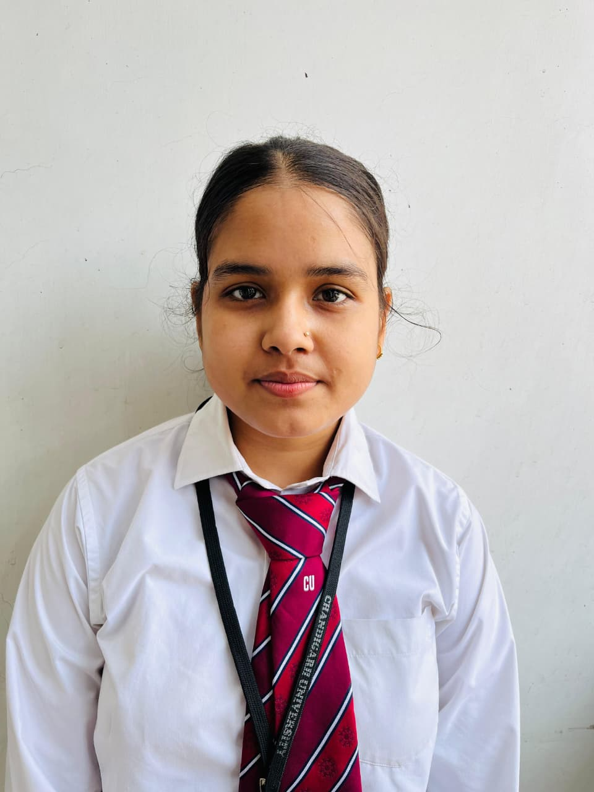

# 👋 Hi, I'm Tanish Jaiswal

## 🚀 About Me
MCA student with strong skills in HTML, CSS, JavaScript, PHP, SQL, Python, Excel, and Tableau.  
I enjoy building web applications and dashboards.  
Looking for an entry-level Web Developer or Software Trainee role.

---

## 🎓 Education
- Chandigarh University – MCA (2026) | 73.5%
- United University – BCA (2024) | 86%
- LVSIC Paina Deoria – Intermediate (2021) | 73.5%
- LVSIC Paina Deoria – High School (2019) | 75.5%

---

## 💻 Skills
- Frontend: HTML, CSS, JavaScript  
- Backend: PHP  
- Database: MySQL  
- Programming: Python, Java  
- Tools: VS Code, GitHub, phpMyAdmin  
- Data: Excel, Tableau  

---

## 📂 Projects

### 🌍 Travel Management System
**Role:** Full Stack Developer  
**Technologies:** HTML, CSS, JavaScript, PHP, MySQL  

**Description:**  
Developed a dynamic web-based travel booking system that allows users to explore destinations, view travel packages, and submit booking requests.

**Key Features:**
- User-friendly interface for browsing destinations and packages  
- Responsive design for mobile, tablet, and desktop  
- Booking form with data storage in MySQL database  
- Admin-side data handling for managing bookings  

**What I Learned:**
- Backend integration using PHP  
- Database design and queries using MySQL  
- Building complete full-stack applications  

---

### 🛒 Online Grocery Website
**Role:** Frontend Developer  
**Technologies:** HTML, CSS, JavaScript  

**Description:**  
Created a responsive online grocery shopping interface where users can view products and simulate an online shopping experience.

**Key Features:**
- Clean and modern UI design  
- Product listing with categories  
- Add-to-cart interface (frontend level)  
- Mobile responsive layout  

**What I Learned:**
- UI/UX design principles  
- Responsive web design  
- JavaScript for interactivity  

---

### 📊 Expense Tracker Dashboard
**Role:** Data Analyst / Dashboard Developer  
**Technologies:** Advanced Excel, Tableau  

**Description:**  
Built an interactive dashboard to track and analyze monthly expenses, helping users understand spending patterns.

**Key Features:**
- Category-wise expense tracking  
- Monthly and yearly comparison charts  
- Interactive filters for better insights  
- Data visualization using charts and graphs  

**What I Learned:**
- Data analysis and storytelling  
- Dashboard design in Tableau  
- Advanced Excel functions and charts  

## 🏆 Achievements
- Certificate in Web Development  

---

## 💼 Internship
- Web Development Intern  
- Worked with HTML, CSS, JavaScript, PHP, MySQL  

---

## 📫 Contact Me
- Email: jaiswaltanish1518@gmail.com  
- Phone: +91 9335731518  
- LinkedIn: https://www.linkedin.com/in/tanish-jaiswal-a552a9241/.....project ye sab jada explain karo ....
